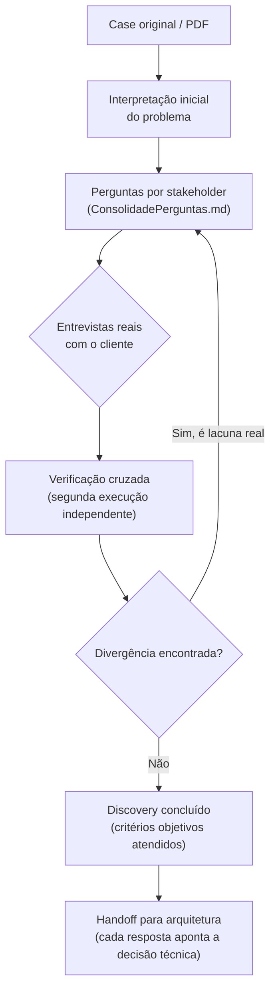

<div align="center">

# 🏭 Projeto de Dados — Indústria Farmacêutica

[](LICENSE)
[](https://github.com/Roberton003/projeto-de-dados-industria-farmaceutica)

<p align="center"><b>Discovery de arquitetura e engenharia de dados para uma indústria farmacêutica com
operação contínua (24h, múltiplas linhas) e dados fragmentados entre ERP, MES, sensores/IoT, qualidade e
manutenção.</b></p>

</div>

> **Nota sobre este README:** este não é um repositório de software — é um repositório de investigação e
> decisão. Por isso não há badge de linguagem/framework (não existe stack de código ainda) nem seção de
> "como rodar" no sentido tradicional — os badges e seções abaixo cobrem só o que é real neste estágio do
> projeto.

## 📌 Project Highlights

- **Nada de arquitetura antes de reduzir incerteza.** Nenhuma ferramenta, plataforma ou stack é escolhida
  enquanto as perguntas abaixo não tiverem resposta real de stakeholder — não suposição do time técnico.
- **Verificação cruzada obrigatória.** Todo levantamento passa por uma segunda execução independente antes
  de ser aceito como pronto — já comprovamos, neste mesmo case, que a primeira resposta sozinha deixa passar
  gaps reais (ex.: fronteira de rede industrial, privacidade de dado pessoal).
- **Cada pergunta tem heurística ou motivo real por trás**, nunca "achismo do consultor" — rastreável até uma
  fonte técnica curada ou uma execução anterior concreta.
- **Handoff explícito para arquitetura.** Cada resposta de Discovery já aponta para a decisão técnica
  específica que ela destrava — quando chegar a hora de desenhar a solução, o time não começa do zero.
- **Dois papéis nunca se confundem:** este repositório cobre *como os dados são coletados, integrados,
  armazenados, processados e disponibilizados* — não indicadores de negócio (Análise de Dados) nem
  viabilidade de Machine Learning (Ciência de Dados), que são investigações separadas.

## 📚 Documentos deste repositório

| Arquivo | O que é |
|---|---|
| [`Case_Comunidados_Industria_Farmaceutica_COMPLETO.pdf`](./Case_Comunidados_Industria_Farmaceutica_COMPLETO.pdf) | O case original, como recebido — não deve ser editado. |
| [`entregafinalv5.md`](./entregafinalv5.md) | Nossa visão do problema e do plano de resposta, em linguagem direta, para qualquer pessoa do time entender sem contexto técnico prévio. |
| [`ConsolidadePerguntas.md`](./ConsolidadePerguntas.md) | Todas as perguntas que vamos fazer a cada área da fábrica — o motivo de cada uma e o que fazemos com a resposta. É o roteiro de investigação em si. |

## 🗺️ Como o processo funciona



Nenhuma seta pula etapa: arquitetura (H) só começa depois que o Discovery (G) estiver de fato fechado —
com evidência de stakeholder real, não suposição do time.

## 🌳 Estrutura do Projeto

```
projeto-de-dados-industria-farmaceutica/
├── Case_Comunidados_Industria_Farmaceutica_COMPLETO.pdf   # case original, não editar
├── entregafinalv5.md                                      # nossa visão, linguagem direta
├── ConsolidadePerguntas.md                                # roteiro de investigação completo
├── README.md                                              # este arquivo
└── LICENSE                                                # MIT
```

## 🤝 Como contribuir e revisar

1. **Sugestões e correções** entram por Pull Request — comente inline no PR ou proponha a mudança direto no
   arquivo. Isso mantém o histórico de quem sugeriu o quê, e por quê.
2. **Nunca edite `main` diretamente.** Crie uma branch (`ajuste/nome-curto`) para qualquer alteração.
3. **Cada versão significativa vira um commit próprio** — evite reescrever histórico (`--force`) depois que
   outra pessoa já revisou.
4. Se você encontrar algo que os documentos atuais não previram (uma pergunta que falta, um risco novo),
   registre isso explicitamente no PR — é assim que o processo de investigação melhora a cada rodada.

## 📄 License

[MIT](LICENSE) © 2026 Roberto Nascimento

---

Roberto Nascimento — [github.com/Roberton003](https://github.com/Roberton003)
